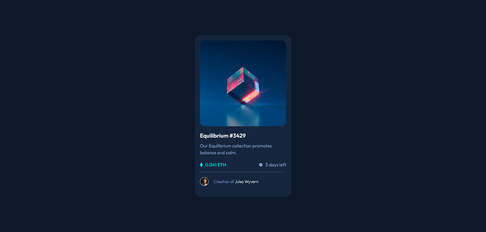

# Frontend Mentor - NFT Preview Card Component Solution

This is a solution to the [NFT preview card component challenge on Frontend Mentor](https://www.frontendmentor.io/challenges/nft-preview-card-component-SbdUL_w0U). 

## Table of contents

- [Overview](#overview)
  - [The challenge](#the-challenge)
  - [Screenshot](#screenshot)
  - [Links](#links)
- [My process](#my-process)
  - [Built with](#built-with)
  - [What I learned](#what-i-learned)
  - [Continued development](#continued-development)
  - [Useful resources](#useful-resources)
- [Author](#author)

## Overview

### The challenge

Users should be able to:

- View the optimal layout depending on their device's screen size
- See hover states for interactive elements

### Screenshot



### Links

- Solution URL: [GitHub](https://github.com/wesleyjacoby/NTF-Preview-Card-Component)
- Live Site URL: [GitHub Pages](https://your-live-site-url.com)

## My process

### Built with

- Semantic HTML5 markup
- CSS custom properties
- Flexbox

### What I learned

The biggest challenge I had with this project was creating the color overlay with the SVG image in the middle. After much research, I eventually got it right with this code:

```css
.overlay {
    position: absolute;
    top: 0;
    bottom: 0;
    left: 0;
    right: 0;
    height: 100%;
    width: 100%;
    opacity: 0;
    transition: .3 ease;
    border-radius: 1.2rem;
    background-color: hsla(178, 100%, 50%, 0.479);
}

.overlay img {
    position: absolute;
    top: 50%;
    left: 50%;
    transform: translate(-50%, -50%);
}

.overlay:active {
    opacity: 1;
}
```

I also attempted to make it somewhat mobile friendly by adding the following code to the body:

```css
min-width: 23.4375rem;
```

And then by adding the following media query:

```css
@media screen and (max-width: 480px) {
    .card-container {
        margin: 0 30px;
        height: fit-content;
    }
}
```

The ```height: fit-content;``` prevents the distance between the creators name and the bottom of the container from getting too large.

### Continued development

I find myself getting more comfortable with Flexbox. I would like more exposure to image overlays though, so I will find more projects that challenge me in that respect. I still have plenty to learn when it comes to responsiveness as well.

### Useful resources

- [w3schools](https://www.w3schools.com/howto/howto_css_image_overlay_icon.asp) - This is the resource that helped me with the image overlay.

## Author

- Frontend Mentor - [@wesleyjacoby](https://www.frontendmentor.io/profile/wesleyjacoby)